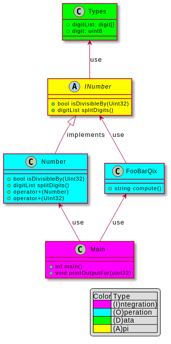

Purpose
============

The purpose of this module is not just to solve the FooBarQix kata. 
The main purpose is to show some principles and patterns useful 
for unit testing. In addition, the code shows how to avoid some 
pitfalls that can arise in software development.

Build Steps
============
This is a fully working exapmle. If you want to try it out please execute:

    cd build
    cmake .. -DCMAKE_BUILD_TYPE=Debug -G "Unix Makefiles"
    make all

    # to run application:
    ./src/FooBarQix_run

    # to run unit tests
    ./test/FooBarQix_test 

Requirements
============

This example solves the coding dojo kata [FooBarQix](http://codingdojo.org/kata/FooBarQix/):

The task is to implement a function "String compute(String)" which implements the following rules.

**Step 1**

Rules
 - If the number is divisible by 3, write “Foo” instead of the number
 - If the number is divisible by 5, add “Bar”
 - If the number is divisible by 7, add “Qix”
 - For each digit 3, 5, 7, add “Foo”, “Bar”, “Qix” in the digits order.

Examples

    1  => 1
    2  => 2
    3  => FooFoo (divisible by 3, contains 3)
    4  => 4
    5  => BarBar (divisible by 5, contains 5)
    6  => Foo (divisible by 3)
    7  => QixQix (divisible by 7, contains 7)
    8  => 8
    9  => Foo
    10 => Bar
    13 => Foo
    15 => FooBarBar (divisible by 3, divisible by 5, contains 5)
    21 => FooQix
    33 => FooFooFoo (divisible by 3, contains two 3)
    51 => FooBar
    53 => BarFoo

**Step 2**

We have a new business request: we must keep a trace of 0 in numbers, each 0 must be replaced by char “*“.
Examples

    101   => 1*1
    303   => FooFoo*Foo
    105   => FooBarQix*Bar
    10101 => FooQix**

Architecture
============

There are a lot of architectur patterns. For this example the [IODA Pattern](http://geekswithblogs.net/theArchitectsNapkin/archive/2015/04/29/the-ioda-architecture.aspx)
is used. The IODA pattern demand to separate the code into (I)ntegration, (O)peration, (D)ata and (A)PI stuff. Doing so leads to reusable and independent 
components with a clear dependency structure.

The following picture show the class dependencies. 
As you can see there are 2 operation modules that do all the work. 

     
The module FooBarQix processes the FooBarQix rules and creates the requested string.
The module number is a generic number representation class that act like a primitive type. It should provide 
additonal information about the number, like divisibility and converting the number in a list of digits.

Additionally the "+" operator was added.This is not needed for solving the FooBarQix kata but should demonstrate 
operator and exception handling. A lot of developers forget to test the operators and exeption handling.
To keep this example simple, the rest of the operators have been omitted.

The integration module takes both operation modules, 
instantiate the objects and call compute() for the numbers given in the example.

As you can see there is no dependency between FooBarQix and Number. 
Both modules depends on the abstract class INumber only. 
Now we can test both operation modules separately.
     
Testing
============

There are 4 tests:
- [FooBarQixTest](test/FooBarQixTest.cpp)
  - Mockist approach of a unit test for class FooBarQix, using INumberMock
- [FooBarQixTestClassic](test/FooBarQixTestClassic.cpp)
  - Classic approach of a unit test for Class FooBarQix, using Number
- [NumberTest](test/NumberTest.cpp)
  - Classic unit test without any dependencies
  - show how to test operator and exceptions
- [MainTest](test/mainTest.cpp)
  - This is an software test to check for solving the kata correctly
  - show how to get rid of main functions
  - shows how to catch std:cout in case there is no other side effect to check for.

FooBarQixTest and FooBarQixTestClassic uses the same names for the test routines. 
So it is easy to compare the different approaches.

Explanations
============
When doing unit testing developers often faced with some common pitfalls. 
This section describes some of these pitfalls and the code will show how to deal with it.

## How to write unit test for modules that contain a main routine? ##
The main function itself is not testable. The unit test will use its own main function. 
Therefore this application main routine have to be removed from the unit test binary, e.g. with a compiler definition. 

~~~~~~~~~~~~~~~{.cpp}
#ifdef MAIN
  int main(void)
  {
    realMain();
    return 0;
  }
#endif
~~~~~~~~~~~~~~~
